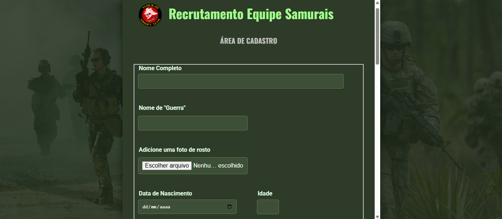

# 🏹 Formulário Recrutamento Equipe Samurais

Formulário temático inspirado em estética **militar**, feito para o recrutamento da equipe **Samurais**. Desenvolvido com foco em identidade visual, responsividade e experiência do usuário.

---

## 🚀 Tecnologias utilizadas

- **HTML5** – Estrutura do formulário
- **CSS3** – Estilo temático (verde/marrom militar + tipografia Oswald)
- **JavaScript** – Validações, cálculo automático de idade, máscara de telefone
- **FormSubmit** – Envio de dados para e-mail
- **Vercel** – Hospedagem gratuita e automática do projeto

---

## 📱 Responsivo

✅ Adaptado para desktop, tablets e celulares  
✅ Imagens laterais removidas em telas pequenas para foco total no formulário  
✅ Layout adaptativo com rolagem interna suave

---

## 🧠 Objetivo

Recrutar novos integrantes para a equipe Samurais com um formulário visual forte, funcional e alinhado à proposta do grupo.

---

## 🔗 Acesse o projeto online

👉 **[Clique aqui para abrir no Vercel](https://samuraisform.vercel.app)**

---

## ✍️ Desenvolvido por

Jorge Michael Correia da Silva  
🔥 Projeto do portfólio de desenvolvimento frontend

---
